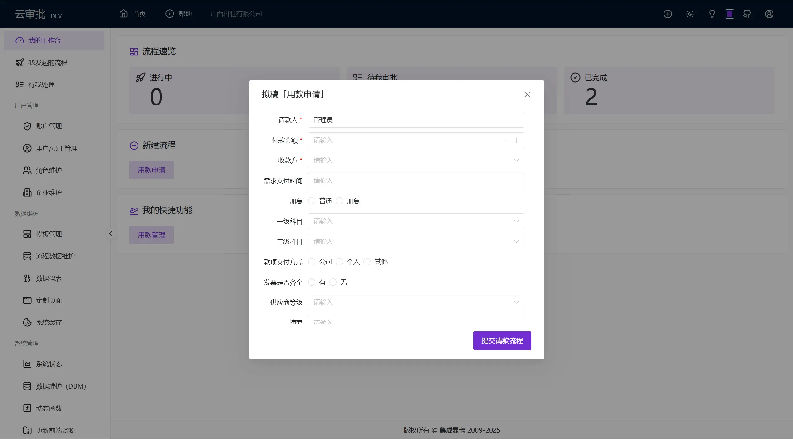
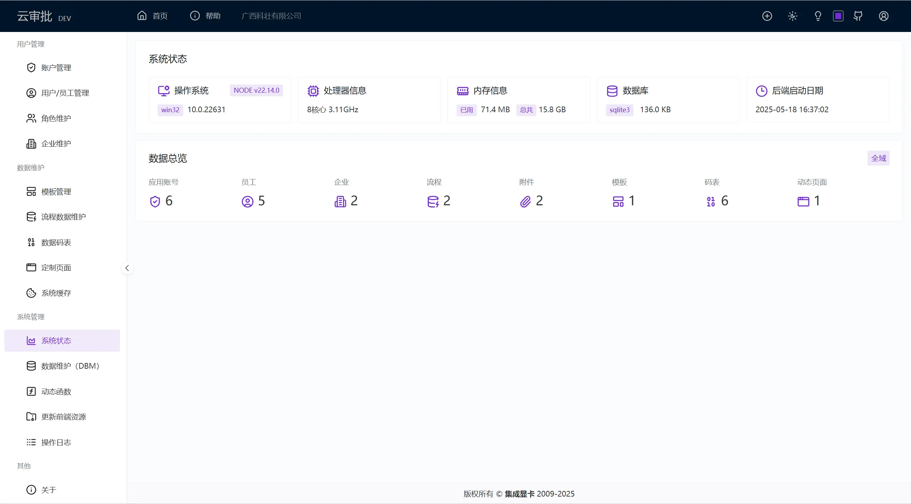

# 云审批/Cloud Approve

**📷 运行预览**

<table style="border: none;">
  <tr>
    <td style="border: none;"></td>
    <td style="border: none;"></td>
  </tr>
</table>

## 二次开发

### 🛠️开发环境

* **node.js**（建议使用 21~22）
* **pnpm**

## 主流平台接入

* [飞书客户端内网页应用接入指南](https://open.feishu.cn/document/uYjL24iN/uMTMuMTMuMTM/development-guide/webapp-incremental-authorization-access-guide)

## uni-app 版本
> 未来支持微信小程序、APP会考虑使用[uni-app](https://uniapp.dcloud.net.cn/)开发

### 参考项目

* [Mall4j商城系统uniapp版本](https://github.com/gz-yami/mall4uni)：商城系统
* [snail-uni](https://github.com/hu-snail/snail-uni)：专为开发者打造的 UniApp 框架模板，基于 UniApp + Vue3 + TypeScript + Vite + Wot Design Uni 的高效框架模板
* [uni-vue3](https://github.com/vue-rookie/uni-vue3)：vue3+vite5+uniapp+unocss+uview-plus搭建的小程序快速开发模板框架
* [无需 HBuildX！用 VSCode 开启 Uniapp 小程序的微信开发之旅](https://juejin.cn/post/7386501850042122274)
* [sard-uniapp](https://github.com/sutras/sard-uniapp)，基于 Uniapp + Vue3 框架开发的兼容多端的 UI 组件库，挺好的，可惜⭐star较少
* [unbest](https://github.com/feige996/unibest)：最好的 uniapp 开发模板，由 uniapp + Vue3 + Ts + Vite5 + UnoCss + wot-ui + z-paging 构成，使用了最新的前端技术栈，无需依靠 HBuilderX，通过命令行方式运行 web、小程序 和 App（编辑器推荐 VSCode，可选 webstorm）
