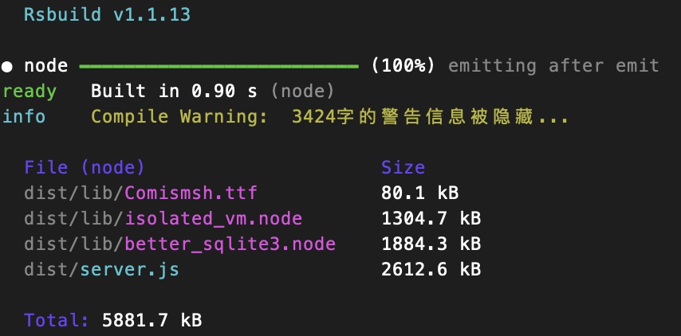

# 云审批服务端

## 依赖说明

* [svg-captcha](https://github.com/produck/svg-captcha)：生成图片验证码
* [isolated-vm](https://github.com/laverdet/isolated-vm)：隔离运行环境
    - 也可以使用 Node.js 内置的 vm 模块（提供了在虚拟环境中运行代码的功能，可以更安全地执行不可信的代码）

### 图片压缩
> 平台使用 `cwebp` 工具进行图片转换，请事先安装对应的版本。之所以没有用另外一个流行的库[sharp](https://github.com/lovell/sharp)，主要是因为打包不方便😄，而且它依赖的底层库将近20M，还是算了

#### Linux 下安装

```bash
# 访问 WebP 官网(https://developers.google.com/speed/webp/download) 下载 Linux 版本的预编译二进制文件，或使用 wget 下载：
wget http://storage.googleapis.com/downloads.webmproject.org/releases/webp/libwebp-1.5.0-rc1-linux-x86-64.tar.gz

# 解压下载的文件
tar -xvzf libwebp-1.5.0-rc1-linux-x86-64.tar.gz
# 复制 cwebp 到 /usr/local/bin
cp libwebp-1.5.0-rc1-linux-x86-64/bin/cwebp /usr/local/bin
# 验证安装
cwebp -version
# 1.5.0
# libsharpyuv: 0.4.1
```

## 打包问题



详见[打包问题.md](打包问题.md)

## 二次开发

### 如何运行 test 文件

```shell
cd server
node ./test/dd.token.test.js
```
